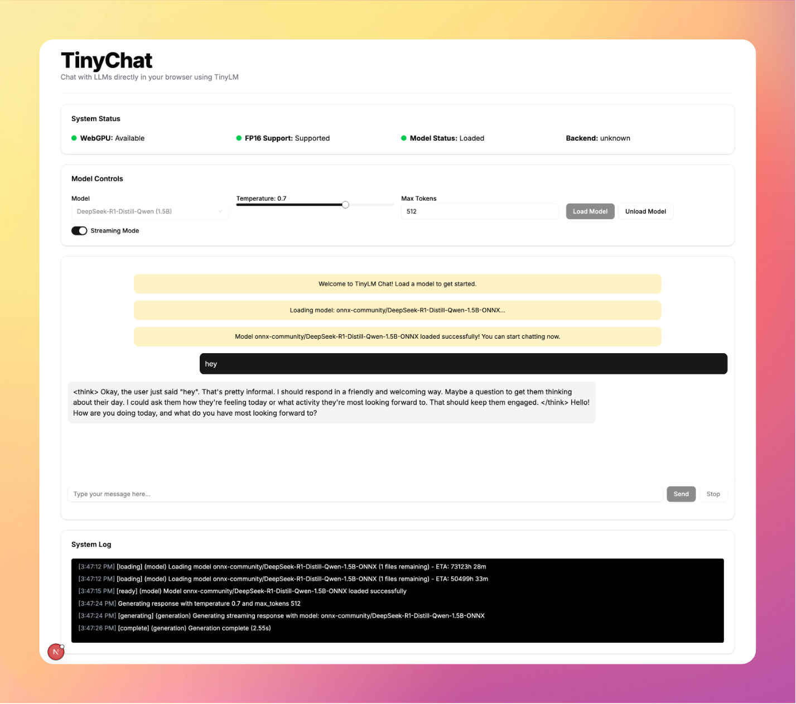

<div align="center">
  <h1> TinyChat </h1>
  <p>
    <a href="https://github.com/wizenheimer/tinylm"><strong>Learn More »</strong></a>
  </p>
</div>



TinyChat lets you run language models like DeepSeekR1, Llama3.2 and more locally, right inside your browser using TinyLM library.

## Features

- **Local LLM Inference**: Run language models entirely in your browser
- **No API Keys**: No external API services or subscriptions required
- **Streaming Output**: Watch responses generate token by token
- **Chat Interface**: Natural conversation-based interaction
- **Customization**: Adjust temperature and generation parameters
- **Model Selection**: Choose from available lightweight models
- **System Status**: Monitor WebGPU support and model loading
- **Persistent Interface**: UI remains responsive during inference

## Technical Stack

- **Next.js** with App Router and TypeScript
- **TinyLM** for LLM inference
- **shadcn/ui** for components
- **WebGPU** (optional) for hardware acceleration

## Browser Requirements

- Modern browser with WebGPU support for optimal performance (Chrome 113+, Edge 113+, or other Chromium browsers)
- Falls back to WebGL when WebGPU is unavailable, but performance will be degraded
- Sufficient RAM (8GB+ recommended) for model loading

## Getting Started

### Installation

```bash
# Clone the repository
git clone https://github.com/wizenheimer/tinychat.git
cd tinychat

# Install dependencies
npm install
```

### Development

```bash
# Start the development server
npm run dev
```

### Production Build

```bash
# Build for production
npm run build

# Start the production server
npm start
```

## Usage Guide

### 1. Load a Language Model

- Choose a model from the dropdown menu (e.g., DeepSeek-R1-Distill-Qwen)
- Adjust the temperature slider (higher values = more creative, lower = more deterministic)
- Set maximum tokens for response length
- Click "Load Model" and wait for the loading process to complete
- The status indicators will show you the model loading progress

### 2. Chat with the Model

- Type your message in the input box
- Press Enter or click Send to submit your question
- Watch as the model generates a response in real-time
- Continue the conversation with follow-up messages
- Use the Stop button to interrupt generation if needed

### 3. Adjust Settings

- Toggle streaming mode on/off
- Adjust temperature during conversation for different response styles
- Change max tokens to control response length

## Performance Notes

- First-time model loading requires downloading model weights (~1-2GB)
- WebGPU acceleration provides significantly better performance
- Generation speed varies based on your device's capabilities
- Laptop/desktop with a discrete GPU recommended for best experience
- Mobile devices will struggle with larger models

## Limitations

- Limited to models that fit in browser memory
- Smaller/distilled models only (not full-sized LLMs)
- Generation speed is slower than server-based solutions
- Currently supports text generation only (no image generation)
- No long-term memory beyond the current conversation

## Attribution

This project uses:

- [TinyLM](https://github.com/wizenheimer/tinylm) for browser-based ML inference
- [DeepSeek-R1-Distill-Qwen-1.5B-ONNX](https://huggingface.co/onnx-community/DeepSeek-R1-Distill-Qwen-1.5B-ONNX) for language modeling
- [shadcn/ui](https://ui.shadcn.com/) for UI components
